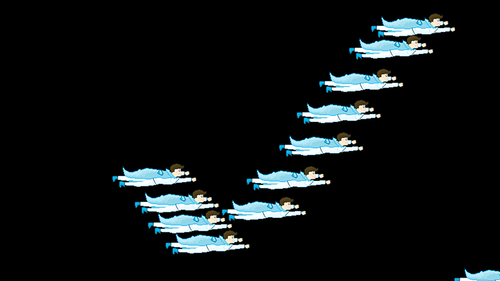

#Tutorial on touch handling in Cocos2d 3.0

Cocos2d 3.0 comes with a completely overhauled touch handling system. This tutorial will provide you with all relevant information about working with touches:

- Accepting touches
- Retrieving touch positions
- Working with different touch lifecycle events
- Implementing a drag & drop mechanism

[Visit our tutorial to get started.](https://www.makegameswith.us/gamernews/366/touch-handling-in-cocos2d-30)

